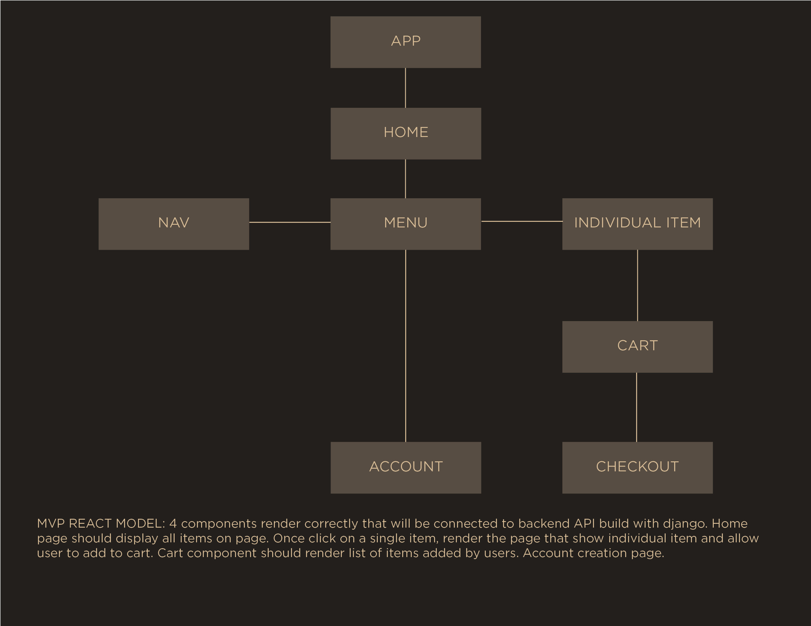
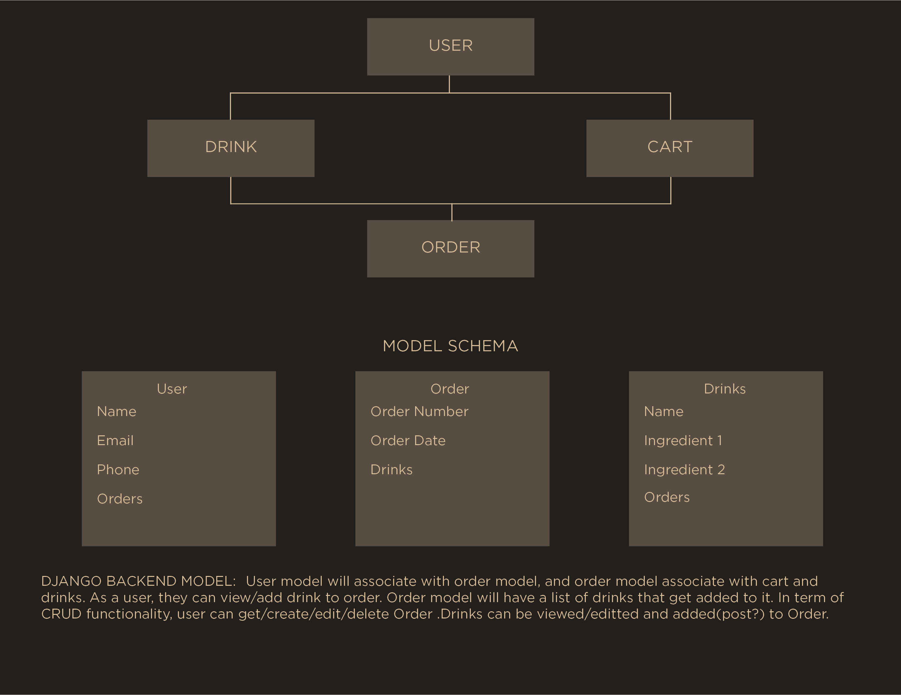
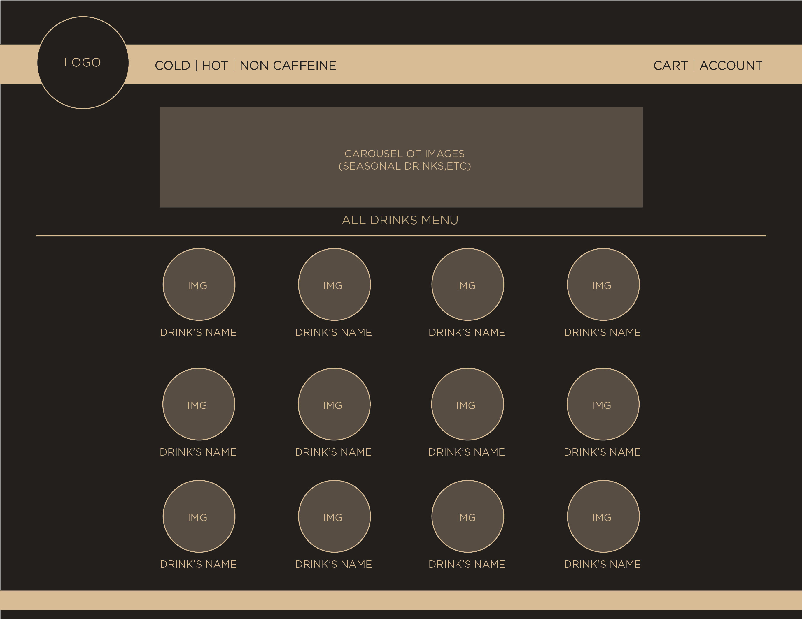
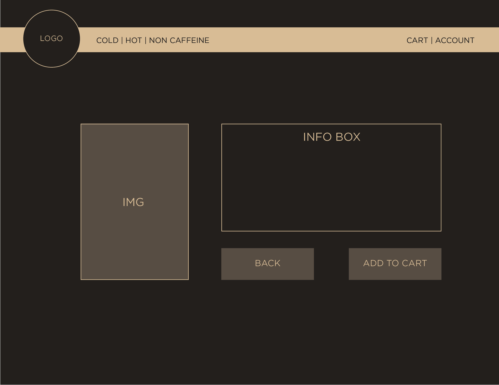

## Project proposal

For this project I'll be doing an e-commerce website where I build the backend database with Django and use React for frontend to connect and interact with backend

### MVP

The website will have 4 react components App-Navigation-Mainpage-Individual Page. The App component should render Nav and Mainpage where Mainpage is the container of images. When click on an item it should take user to the correct page display information about the clicked item. Nav should display on every page so users can navigate back to the home page. User will be able to add item to cart and view Cart page

### Silver Goal

Add customize feature that allow user to customize their drinks and add to cart

### Gold Goal

add google map for store/location

### Platinum Goal

implement payment handling

Below is a simple diagram of the components and my thought process when planning for the components hierarchy.

## Wirefame

I created the basic layout using wireframing method to ideate the website looks and feel, placing each individual items and element of how they should display on the page. This is a starter and could slightly change over time as project progress. 

